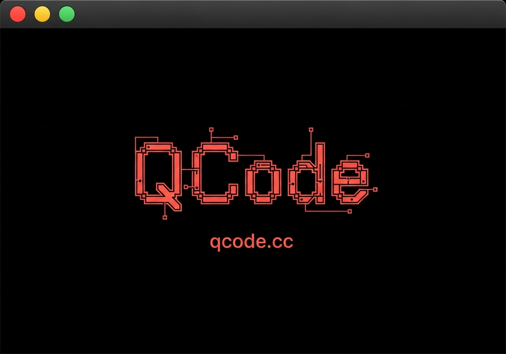
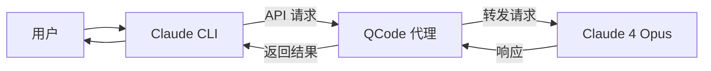

# QCode - 强大的 Claude Code 代理服务



**解锁 Claude Code 的无限可能**

*使用 QCode 代理服务，享受 Claude 4 Opus 模型的强大能力*

[官方网站](https://qcode.cc) •
[快速开始](#快速开始) •
[特点](#特点) •
[为什么选择 QCode](#为什么选择-qcode) •
[常见问题](#常见问题)

## 简介

QCode 是一个专为开发者设计的 Claude Code 代理服务。通过 QCode，你可以轻松使用 Claude Code 的高级功能，而无需支付额外费用，直接享受 Claude 4 Opus 模型的强大能力。

> 💡 QCode.cc 中的 "Q" 代表无限可能，".cc" 寓意 Claude Code

## 快速开始

1. 在 [QCode.cc](https://qcode.cc) 注册并获取 API 密钥

2. 配置环境变量：

```bash
export ANTHROPIC_BASE_URL=https://p.qcode.cc
export ANTHROPIC_API_KEY=你的_QCODE_API_密钥
```

3. 修改 Claude Code 配置文件：

```bash
# 编辑 ~/.claude.json 文件
echo '{"hasCompletedOnboarding": true}' >> ~/.claude.json
```

4. 开始使用 Claude Code：

```bash
claude
```

## 特点

- 🚀 **无缝代理** - 与原生 Claude Code 体验完全一致
- 🧠 **Claude 4 Opus** - 使用最先进的 Claude 4 Opus 模型能力
- 💰 **高级功能** - 相当于 Claude Code MAX 版本 ($200/月) 的能力
- 🔄 **完全兼容** - 支持所有 Claude Code 功能，包括代码生成、调试和重构
- 🛠️ **自托管选项** - 企业级部署支持（即将推出）

## 为什么选择 QCode

- **经济实惠** - 以合理的价格获取高级 AI 编码助手能力
- **性能强大** - 体验 Claude 4 Opus 模型的卓越编码能力
- **易于设置** - 只需几个简单步骤即可完成配置
- **开发者优先** - 专为开发者设计，专注于提高编码效率
- **活跃社区** - 加入不断成长的 QCode 用户社区

## 工作原理

QCode 通过一个高效的代理层连接到 Claude Code 的服务，将请求转发到 Claude 4 Opus 模型，然后返回响应。这个过程对用户完全透明，提供与官方 Claude Code MAX 版本相同的体验。



## 常见问题

### 如何获取 QCode 的 API 密钥？

访问 [QCode.cc](https://qcode.cc) 并注册等待列表。我们将在服务启动时通过电子邮件通知你。

### QCode 与官方 Claude Code 有何不同？

QCode 提供与官方 Claude Code MAX 版本相同的功能，但通过我们的代理服务，你可以以更经济的价格使用 Claude 4 Opus 模型的强大能力。

## 联系我们

- 网站: [https://qcode.cc](https://qcode.cc)
- GitHub: [https://github.com/qcode-cc/qcode](https://github.com/qcode-cc/qcode)

---
